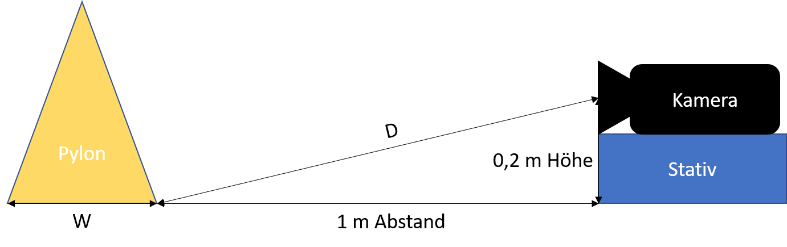

# Data Exploration Project WIDSB 18
## Pylone Detection and Distance Meassuring for autonoumnus racecars

1. [Goal of this project](goal)
2. [Teammembers](Teammembers)
3. [Set up the Applicaiton](Installation)
4. [How to use the Application](use)
5. [Train your own Model](Train)

## Goal of this project

The goal of this project is it to deliver an application with following functionalities:

1. adjustment of the application
2. prediction of traffic cones on a given picture
3. calculation of distance from camera to cones and cones to cones

For further detail please have a look at the paper for this project.

## Teammembers

- Stephan Lenert
- Peter Behrens 
- Tom Müller
- Luca Stuckenborg

## Set up the Application

### Mandatory system requirements:
- Python version 3.7.7 is recomended due to libary compatibility

### Steps to set up the application:
1. Clone the git repository
    - Move in the git bash to the desired dictionary and execute `git clone https://github.com/StephanDieGeileSau/pylone-detection.git`
2. Install pip dependencies
    - Move into the pylone-detection dictionary `cd \pylone-detection`
    - Install the dependencies and python libaries `pip install -r requirements.txt`
3. Test the application
    - Execute via python the predict.py file (`python predict.py`)
    - If everything workes you should find now 5 images with boxes in the `.\output` folder
4. The application is set up!

## How to use the Application

### Adjusting
1. Take a picture as described in the project paper

2. Place the picture in the `.\adjust` folder
3. Run `python adjust.py`
4. The adjustment values get stored in the `adjust.json` file

### Prediction
The for the prediction used model can be changed in the `model.py` file. The line and values you can palce, are noted as comments. 

You can also predict multiple images at the same time, just place all images you want predicted in the same folder.

1. Take pictures for prediction 
2. Place the pictures in the `.\images` folder (to use a specific path pass the path as parameter to the `predict.py` in step 3.)
3. Run the prediction via `python predict.py` you can also specify the input and outpur directory `python predict.py -i<path to input dir> -o<path to output dir>` (default input: `.\images` and output: `.\output`)
4. Now you can find the predicted images in the corresponding folder

### Distance Meassuring

1. Place one image you want to be calculated in the `.\predict` folder
2. Run `python calc_2d_map.py`
3. You will see the meassured distances as print out in the command line
    - y_b stands for distance between the cones
    - b stands for the distance from the camera to the blue cone
    - y stands for the distance from the camera to the yellow cone
    - if there is only one of two cone types detected the not meassureable values will have the value `None`

## Train your own Model

If you want to train your own Object Detection Model, based on one of the already existing Models in the Tensorflow Zoo, we recommend you to follow the [tutorial of Joseph Nelson](https://towardsdatascience.com/training-a-tensorflow-faster-r-cnn-object-detection-model-on-your-own-dataset-b3b175708d6d).
